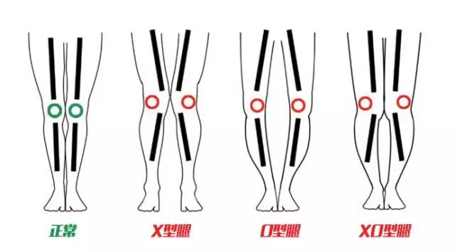

# 腿形判断
自然站直，将双腿并拢，观察两腿之间线条

1. 如果脚踝和膝盖可以并拢，双腿比较直，可以互相靠拢，腿型正常；
2. 如果膝盖可以靠拢，但双脚不能并拢，则很可能为X型腿；
3. 如果双脚可以并拢，而膝盖不能并拢，双膝外张，则很可能为O型腿；
4. 如果你的双膝双脚都没有问题，只是小腿（胫骨）分得很开，那么你可能是XO型腿。

# 成因：
  - 天生骨骼问题外
  - 软骨发育障碍，如缺乏维生素D、缺钙
  - 不良站姿
  - 不良训练动作
  - 外旋外展肌无力、内收肌群紧张

# 矫正
1. 屈髋肌群拉伸
  1. 战士一式
  2. 髂腰肌动态拉伸
  3. 阔筋膜张肌拉伸
  4. 内收肌拉伸
2. 加强薄弱肌肉
  1. 跪姿髋外展
  2. 蚌式
3. 标准动作模式强化
  1. 深蹲

#日常注意:
  - 不要采用翘二郎腿坐、盘坐、跪坐等不良坐姿
  - 调整站姿：仔细回想一下，平时站立的时候，你的外展肌是不是根本没有发力？
  - 调整走路姿势
    身体直立、收腹直腰、两眼平视前方，双臂放松在身体两侧自然摆动，脚尖微向外或向正前方伸出，跨步均匀。

# Appendix
- FitTimeNow, *怎样纠正X型腿？* ( 2018-June-05) <https://www.zhihu.com/question/28580841> [accessed 8 May 2019].