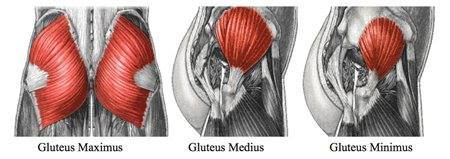

# 臀部肌肉介绍:
1. 臀大肌：
  - 包裹在臀部外层的最大的肌肉，其体积是臀中小肌的几倍之和，并且又分为上束纤维和下束纤维，这块肌肉体积较大，是臀部塑造的基础。 
  - 呈扇型的臀中肌附着在臀部的外侧，这块肌肉的强化可以影响到：
    1. 臀部的宽
    2. 臀线高低
  
2. 臀小肌：
  相对臀中肌较短，附着在臀部的位置最深且最轻，通常可以和臀中肌一同锻炼到。

# 动作list:
1. Pull Through

## 软组织处理 Soft Tissue Release 
软组织处理的要求就是很多人做了动作感觉不到酸，这可能跟你部分肌肉过于活跃，因此抢去了臀部肌肉的训练。
1. 髋屈肌拉伸 (Hip flexor stretches)
2. 腘绳肌拉伸 (Hamtring Stretch)

## 激活 Active
1. 分腿臀桥

## 强化 Strength Training
1. 怪兽行走 (Monster Walk)
2. 臀冲 (Hip Thrust)
3. 单腿罗马尼亚硬拉 (Single Leg RDL)
4. 抬高式单腿臀桥 (One-Leg Foot-Elevated Bridges)

## 辅助动作
1. 宽站距深蹲
2. 向前弓箭步蹲
3. 跪姿后抬腿
4. 迈上台阶
5. 蚌式

## 建议课表
1. By 知乎 - 郭福临
  - 加入到你的下肢日训练当中去
  - 每周做 2 次Pull through（就是说你要每周练两次下肢）
  - 每次使用15RM的重量，做3~5组，每组8~12次，间歇60s

2. By 知乎 - 林烁
  |周一|周三|周五|
  |髋屈肌拉伸   每个动作进行30秒，三次，换边|髋屈肌拉伸   每个动作进行30秒，三次，换边|髋屈肌拉伸   每个动作进行30秒，三次，换边|
  |腘绳肌拉伸   每条腿保持30-60秒 各进行3组|腘绳肌拉伸   每条腿保持30-60秒 各进行3组|腘绳肌拉伸   每条腿保持30-60秒 各进行3组|
  |分腿臀桥   每组30次 2组               |分腿臀桥   每组30次 2组                |怪兽行走   横行移动15步 再返回 3躺来回  
  |怪兽行走   横行移动15步 再返回 3躺来回  |跪姿后踢腿   每组15-25次每边 3组       |臀冲/单腿 or 双腿   每组15-25次 3组    |
  |臀冲/单腿 or 双腿   每组15-25次 3组    |单腿罗马尼亚硬拉   每边15次 3组        |抬高式单腿臀桥（有困难降阶分腿臀桥） 每组15-20次 3组|