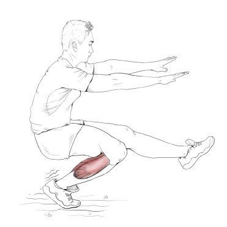

# 单腿下蹲标准：
- 受试者自然站立 ，双臂前屈伸直平行于地面
- 向前抬起一条腿保持伸直，支撑腿下蹲至大腿与小腿贴紧后再站起 （脚尖也要绷直）
- 整个过程保持动作平稳，支撑脚跟不离地，抬起腿不碰触地面

# 单腿下蹲目的：
测试你的身体下肢功能：
  - 关节肌肉力量，即肌肉的离心能力和向心能力
  - 神经肌肉协调性，简单的说就是神经兴奋时引起肌肉协同工作的过程。
  - 以及核心控制能力，足部与膝关节稳定性、平衡性、踝与髋关节灵活性等。

# 打分标准
1. 膝关节出现疼痛     （0分）
2. 不能完成          （1分）
3. 勉强完成（有晃动）  （2分）
4. 顺利完成（动作平稳）（3分）

# 分数分析
## 2分的分者
  - 单腿下蹲这个动作时是处于一个较为勉强的状态
  - 可能存在的问题是稳定性和平衡能力较差、核心力量弱，那么跑步时就有导致有力发不出，以致无法顺利完成动作。
  - 跑步中容易疲劳，受伤风险提升。
  解决方法：
    - 臀桥写字
    - 蜥蜴爬行
    - 保加利亚剪蹲
    - 强化剪蹲

## 1分的分者
1. 脚跟离地
  - 脚跟不能一直着地。
  - **踝关节活动度不够**，小腿三头肌伸展性不足，跑步时容易抽筋。
  解决方法：
  - 通过小腿的拉伸和离心收缩，延展小腿肌群恢复肌肉弹性，提升踝关节的活动度，如台阶跳下动作。
  
2. 蹲不下去
  - 下肢肌群的离心收缩能力不足，跑步时最容易出现拉伤
  - 容易抽筋
  解决方法：
  剪蹲训练，下蹲时动作要很缓慢有控制，改善离心收缩能力。
  [单腿下蹲_蹲不下去](./单腿下蹲_蹲不下去.jpg "单腿下蹲_蹲不下去")
3. 起不来
  - 能蹲下，起不来。下肢的力量不足，尤其是作为启动的臀部肌群。
  - 跑步时臀肌力量不足，会影响膝关节的稳定和导致大腿、小腿肌肉的疲劳紧张。
  - 容易“跑步膝”
  解决方法：
  - 屈膝后摆腿
  - 贝壳外展
  - 剪蹲训练
  - 深蹲训练
  - 通过开链和闭链综合训练，激活强化臀肌。
  [单腿下蹲_起不来](./单腿下蹲_起不来.jpg "单腿下蹲_起不来")
4. 下蹲时向后倒/前腿伸不直
  - 腘绳肌过于紧张
  - 提高了拉伤的风险
  - 会引起大腿变粗
  解决方法：
  - 单腿直膝硬拉和大腿后群拉伸，提高腘绳肌的柔韧性和弹性，防伤又瘦腿。
  [单腿下蹲_腿伸不直](./单腿下蹲_腿伸不直.jpg "单腿下蹲_腿伸不直")
  [单腿下蹲_向后倒](./单腿下蹲_向后倒.jpg "单腿下蹲_向后倒")

# Appendix
- 李明威, 长期跑步如何保护膝盖？ (2016-May-08) <https://www.zhihu.com/question/20772183/answer/94233803> [accessed 8 May 2019].
