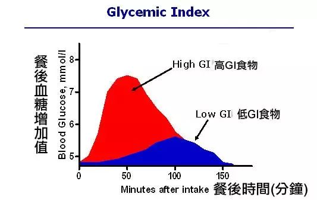

# Definition:
  - GI =（Glycemic Index 血糖生成指数）
  - 是反映**食物引起人体血糖升高程度的指标**，是人体进食后机体血糖生成的应答状况。

# Application:
  它是用于测量**食物的消化和吸收的速率及对血糖的影响**:
    拿50g燕麦和50g米饭举例，低GI的燕麦在摄入后血糖会缓慢升高。高GI的米饭，糖分消化吸收的速度快， 短时间内的血糖会迅速上升。
  

# 分类：
|低GI|中GI|高GI|
|----|----|----|
|GI < 55|55 <=GI <= 70| GI > 70|

{info}
- 一般GI值在40以下的食物，是糖尿病患者可安心食用的食物。
{info}

# 会影响低食物的GI值因素：
1. 食物的纤维含量；
2. 食物的物理形态（固体、液体等等）；
3. 食物的加工方式（生的、熟的、添加剂等等）。
{info}
任何食物的GI值对不同的人也有很大差异，所以测量食物对自己的影响也很重要。
{info}

# 高GI食物 VS 低GI食物
- 高GI食物：
  在短时间内会使血糖升高，胰岛素唤起身体机能，将吃进体内的热量转化为脂肪，大量胰岛素使血糖快速下降，造成饥饿感，使我们吃进更多东西。
- 低GI食物:
  1. 消化吸收作用会相对较慢，让血糖值维持在比较稳定的状态，能带来更长时间的饱腹感，正常供应身体细胞利用.
  2. 不会囤积过多脂肪，也不会有暴饮暴食的情形发生，当然也就不易变胖。

# 低GI饮食 VS 低碳饮食
- 低碳饮食:
  是严格控制碳水的摄入，从而达到减脂瘦身的效果；
- 低GI饮食:
  并不限制碳水的摄入，而是提倡碳水的合理选择。

# 低GI Application：
1. 帮助想要减肥或保持健康体重的人群有效的控制体重；
2. 提供稳定和持续的能量释放，稳定血糖水平，可以作为糖尿病治疗计划一部分；
3. 延长食物的消化和吸收的时间，可以带来更长时间的饱腹感。

# 食物GI List
## 低GI食物
## 中GI食物
## 高GI食物

# Caution
{danger}
常见误区
- GI是决定某一特定食物中碳水化合物(糖)含量的最佳方法：
  血糖指数描述血糖在血液中释放的速率，并没有说明碳水化合物的含量。
  碳水化合物摄入越多，血糖反应越高，因为血糖负荷增加。所以要把GI和GL值放在一起看。
- 土豆、意面这种白色食物不能吃，因为它们是高GI食物。
  食物的白色并不一定意味着它有高血糖指数。
  如前所述，烹饪方法、加工量和膳食成分影响GI，而不是食物颜色。
  例如，煮土豆的GI比微波土豆(82)要低得多。许多人没有意识到的是意大利面食是一种低GI食品(40-50)。
- 血糖指数可以用来评估健康和不健康的食物。
  GI并不表示食物是否健康。其中一个例子就是牛奶。全脂牛奶有27种，脱脂牛奶有32种。低GI并不总是意味着更健康的产品。
- 所有简单的糖都是高GI
  不是所有的糖都是相等的。
  例如，水果中含有简单的糖果糖。这种简单的糖比葡萄糖的消化和吸收速度慢，因此产生低血糖反应。大多数生水果的GI是在30-50之间。
-我可以吃尽可能多的低血糖食物，保持低胰岛素水平。
  一些人认为，低GI的饮食使他们可以随心所欲地消费。
  但低GI饮食可以得到高胰岛素反应！血糖反应是GI x碳水化合物浓度(血糖负荷)的组合，所以摄入的碳水化合物越多，胰岛素水平就越高。
{danger}        

# Appendix:
- CHANDRA JOHNSON-GREENE, *Glycemic Index Charts: Low, Medium, and High* (2019-January-16) <https://universityhealthnews.com/daily/nutrition/glycemic-index-chart/> [accessed 8 May 2019].
- 即刻运动Official的回答, *高GI食物有哪些?* (2019-March-15) <https://www.zhihu.com/question/29533602/answer/275520480> [accessed 8 May 2019].                                                                                                                                                         